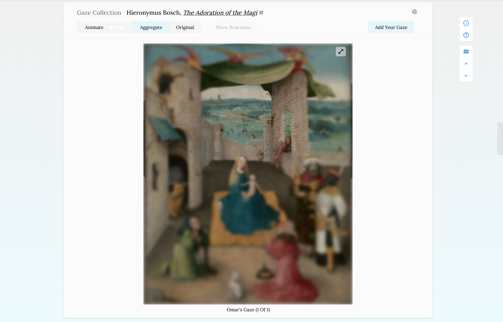

# Context

- Title: How We Gaze
- Subtitle: Visualizing how we look at artwork
- URL: http://omarnema.com/how-we-gaze/public/index.html
- By Omar Nema

### Description

How We Gaze is a meta-gallery that shows how individuals gaze at pieces of artwork. The gazes hosted in the gallery are crowd-sourced - individuals are invited to view pieces of artwork, and see their gaze visualized in realtime.

This project was built using the Svelte.js as a framework, d3.js for visualization, webgazer.js for eye-tracking, and Firebase for data storage. Observable was used for data exploration.

### Abstract

In an art gallery or museum, a viewer is typically engaged in a one-way reading process: they study a piece on their own. The gallery is not built as a participatory environment, but as a space for silent, solo viewing. Beyond the physical design of the gallery, each individual is limited to language as the primary means to communicate their thoughts on a piece of artwork.

We cannot see how others see. And as a result, we may not understand how others connect to (or do not connect to) a given piece of artwork. Could showing how someone gazes at art connect us closer to that piece? Could doing so bring us closer to that person, and their perspective in that moment?

How We Gaze is a project that visualizes how individuals study art through the use of eye-tracking and web-based data visualization. Within its interface, individuals are invited to view pieces of artwork, and see their gaze visualized alongside others’ in real-time. In visualizing how we look at art, How We Gaze attempts to connect viewers both to a curated set artwork and to the individuals who gazed at it.



### Preview Video

[See demo](demo.mp4)

### Acknowledgements

Alec Barrett and Daniel Sauter for serving as mentors and helping to guide the project, Rayyan Mikati for helping with curating artwork.

# Technical

### Scripts

```
npm run dev // start project
npm run build //run build version
npm install // install dependencies
```

### Deployment

Deployment runs off 'deploy' branch
Merge strategy used below

```
git checkout staging
git merge -s ours email # Merge branches, but use our (=staging) branch head
git checkout email
git merge staging
```

Note that app is hosted within public folder. Index file in root re-directs to index file within public folder.
